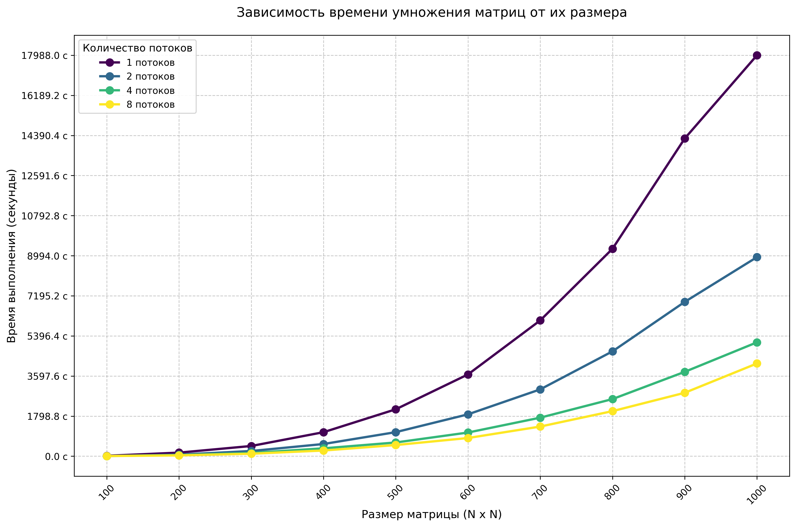

# Лабораторная работа №2
6313-100503D Старцева Анна Владимировна

## Задание
Модифицировать программу из л/р №1 для параллельной работы по технологии OpenMP.

## Характеристики ноутбука
1) Процессор - AMD Ryzen 5 5500U with Radeon Graphics 2.10 GHz, ядер: 6, логических процессоров: 12
2) Оперативная память - 8 ГБ
3) Тип системы - 64-разрядная операционная система, процессор x64
4) Видеокарта - AMD Radeon(TM) Graphics

## Содержание:
1) `laab2.cpp` - основной файл для создания и перемножения матриц с поддержкой OpenMP.
2) `auto_verify.py` - верификации и построение графика.
3) `../matrix_results` - сохранены результаты матриц и перемножения в формате `.txt`.
4) `stats.txt` - метрика времени в зависимости от размера матрицы.
5) `performance_plot.png` - график времени от размера метрицы.
6) `verify.txt` - результаты проверки.

## График
Для замеров времени были выбраны квадратные матрицы размером от 100 до 1000 с шагом 100 элементов.
Матрицы содержали случайные числа в диапазоне 0 до 99.

В результате проведения лабораторной работы была построена следующая зависимость времени выполнения от количества элементов

## Вывод
При перемножении двух матриц с поддержкой OpenMP было замечено, что 8 потоков самое оптимальное по времени выполнения для характеристик данного ноутбука.