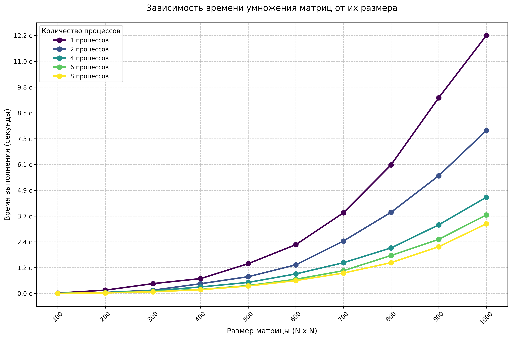
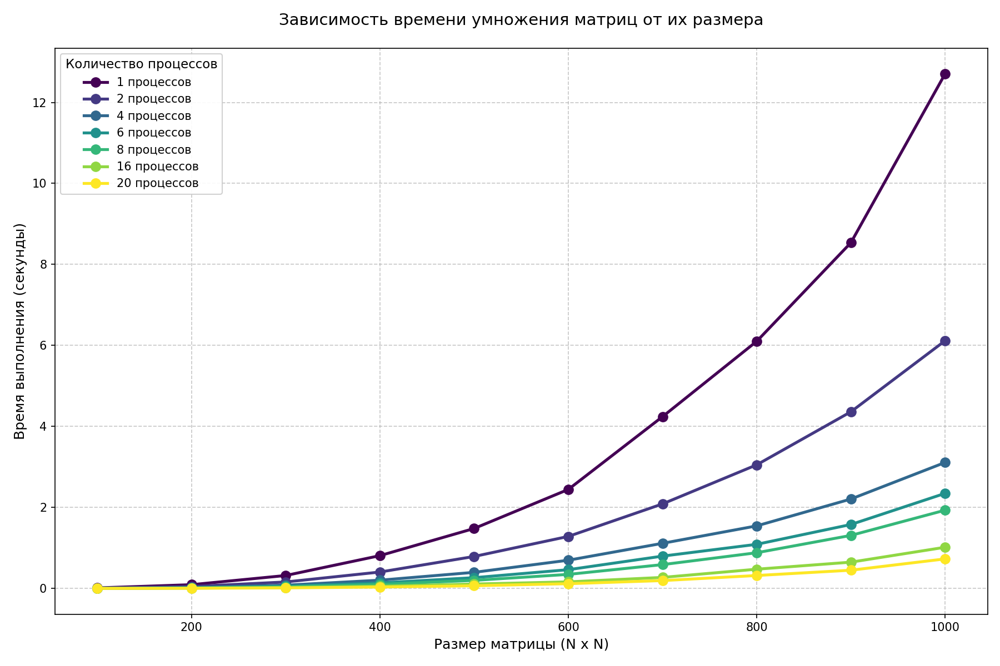

# Лабораторная работа №3
6313-100503D Старцева Анна Владимировна

## Задание
Модифицировать программу из л/р №1 для параллельной работы по технологии MPI. Одну из параллельных версий программ 
(на выбор, но целесообразнее всего MPI) необходимо также запустить на суперкомпьютере «Сергей Королёв».

## Характеристики ноутбука
1) Процессор - AMD Ryzen 5 5500U with Radeon Graphics 2.10 GHz, ядер: 6, логических процессоров: 12
2) Оперативная память - 8 ГБ
3) Тип системы - 64-разрядная операционная система, процессор x64
4) Видеокарта - AMD Radeon(TM) Graphics

## Содержание:
1) `main.cc` - основной файл для создания и перемножения матриц с поддержкой MPI.
2) `main_super.cpp` - файл для создания и перемножения матриц с поддержкой MPI на суперкомпьютере «Сергей Королёв».
3) `auto_verify.py` - верификации и построение графика.
4) `auto_verify_super.py` - построение графика для результатов на суперкомпьютере «Сергей Королёв».
5) `../matrix_results` - сохранены результаты матриц и перемножения в формате `.txt`.
6) `matrix_results/all_execution_times.txt` - сохранены замеры времени для вычисления матриц для каждого размера и процесса.
7) `../super` - сохранены результаты замера для матриц и их перемножения на суперкомпьютере «Сергей Королёв» в формате `.txt`
8) `run_mpi.py` - вспомогательный файл для запуска основного файла `main.cc`.
9) `run.pbs` - скрипт для запуска `main_super.cpp` на суперкомпьютере «Сергей Королёв».
10) `performance_plot.png` - график времени от размера метрицы.
11) `mpi_performance_plot.png` - график времени от размера метрицы на суперкомпьютере «Сергей Королёв».
12) `verify.txt` - результаты проверки.

## График для замеров на ноутбуке
Для замеров времени были выбраны квадратные матрицы размером от 100 до 1000 с шагом 100 элементов.
Матрицы содержали случайные числа в диапазоне 0 до 99.

В результате проведения лабораторной работы была построена следующая зависимость времени выполнения от количества элементов

## График для замеров на суперкомпьютере «Сергей Королёв»

## Иследование возможностей суперкомьютера

## Вывод
По результатам проделанной работы, было выявлено, оптимальное количество процессов для ноутбука и суперкомпьютера. 
Технология MPI показала хорошую производительность, особенно хорошие результаты вывявлены на суперкомпьютере. 
Также были изучены работа на суперкомпьютере и настройка подключения к нему.