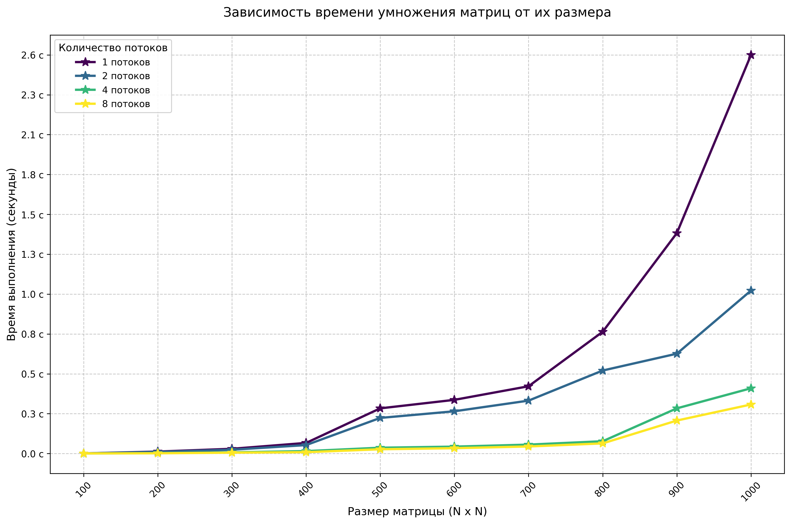

# Лабораторная работа №4
Выполнили студенты группы 6313-100503D 

Старцева Анна Владимировна, Маслова Алена Руслановна и Литвинов Денис Евгеньевич.

## Задание
Модифицировать программу из л/р №1 для параллельной работы по технологии CUDA.

## Характеристики ноутбука, который использовали с видеокартой
1) Процессор - AMD Ryzen 7 4800HS with Radeon Graphics 2.90 GHz, ядер: 8, логических процессоров: 16
2) Оперативная память - 16 ГБ
3) Тип системы - 64-разрядная операционная система, процессор x64
4) Видеокарта - NVIDIA GeForce RTX 2060 with Max-Q Design

## Содержание:
1) `main.cu` - основной файл для создания и перемножения матриц с поддержкой CUDA.
2) `check.py` - верификации и построение графика.
3) `../matrix_results` - сохранены результаты матриц и перемножения в формате `.txt`.
4) `matrix_results/stats.txt` - метрика времени в зависимости от размера матрицы.
5) `grafic.png` - график времени от размера метрицы.
6) `check.txt` - результаты проверки.

## График
Для замеров времени были выбраны квадратные матрицы размером от 100 до 1000 с шагом 100 элементов.
Матрицы содержали случайные числа в диапазоне 0 до 99.

В результате проведения лабораторной работы была построена следующая зависимость времени выполнения от количества элементов

## Вывод
При перемножении двух матриц с поддержкой CUDA было замечено, что 8 потоков самое оптимальное по времени выполнения для размера матриц от 100 до 1000, также было замечено, что CUDA очень эффективна для для матриц большего размера.